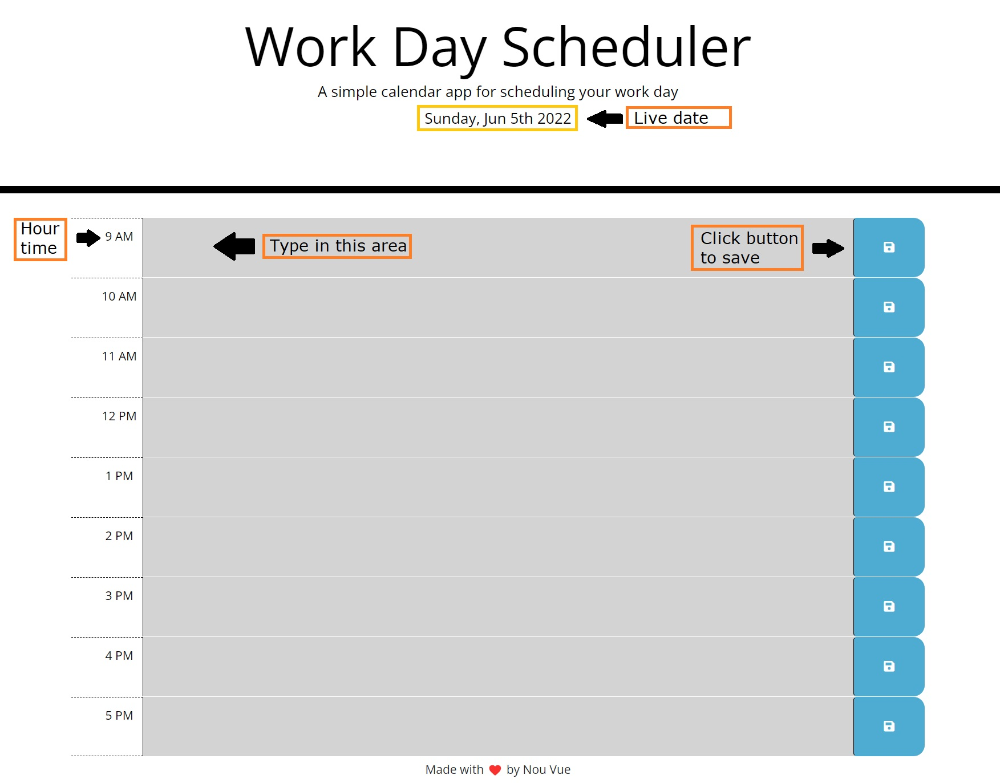

# Work Day Scheduler

## Purpose
A day scheduler that shows a live date and also has live time tracking. Helping you keep track on what you have scheduled through out the day and with the differnet color coding for past, present and future, makes it easier and quicker to see what what has been done and what you have scheduled is coming up next.

## Built With 
HTML **|**
CSS **|**
JS

## Website
[Work Day Scheduler](https://andyboyee604.github.io/Work-Day-Scheduler/)

## Usage

## Sources Referenced
[Google](https://www.google.com) **|**
[MDN Web Docs](https://developer.mozilla.org/en-US) **|**
[w3 Schools](https://www.w3schools.com) **|**
[GetBootStrap](https://getbootstrap.com/docs/4.0/getting-started/introduction/)

## Made with ❤️ by Nou Vue